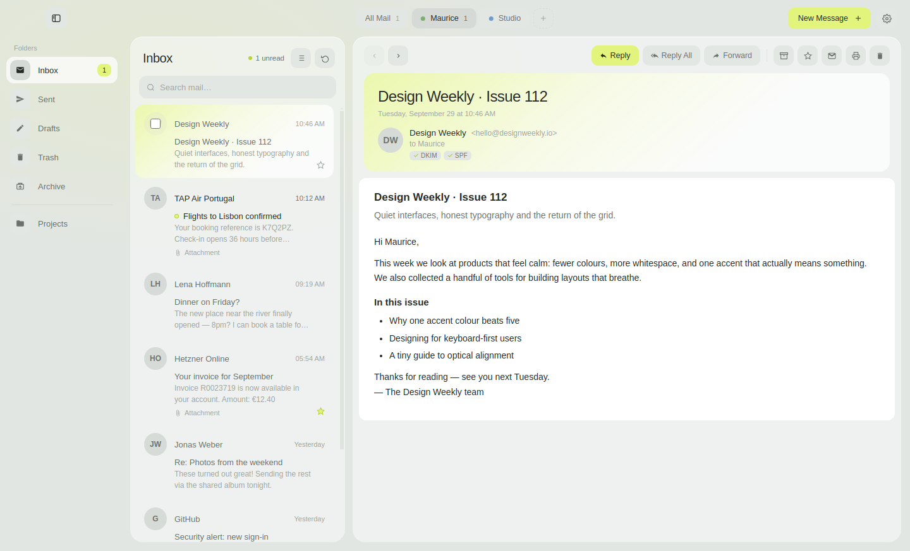
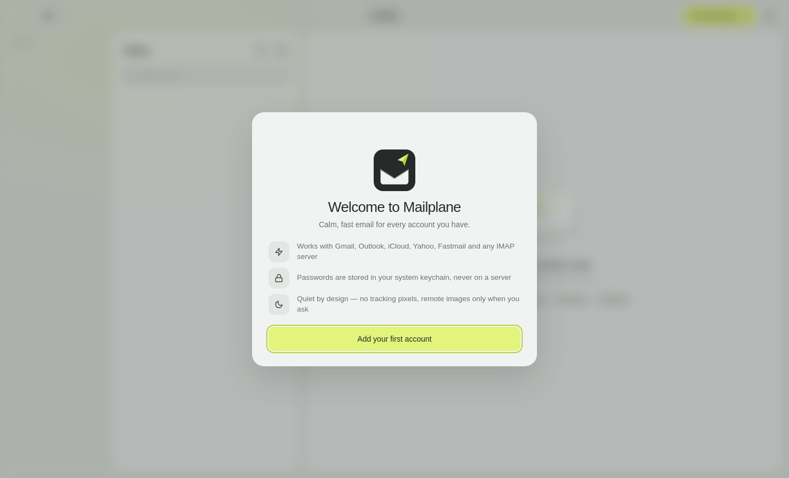
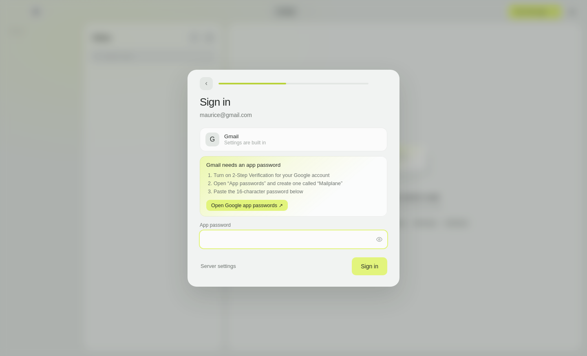
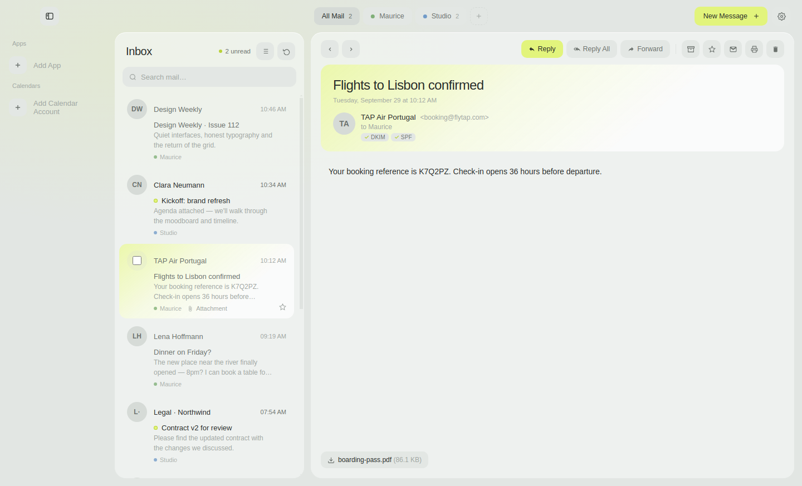
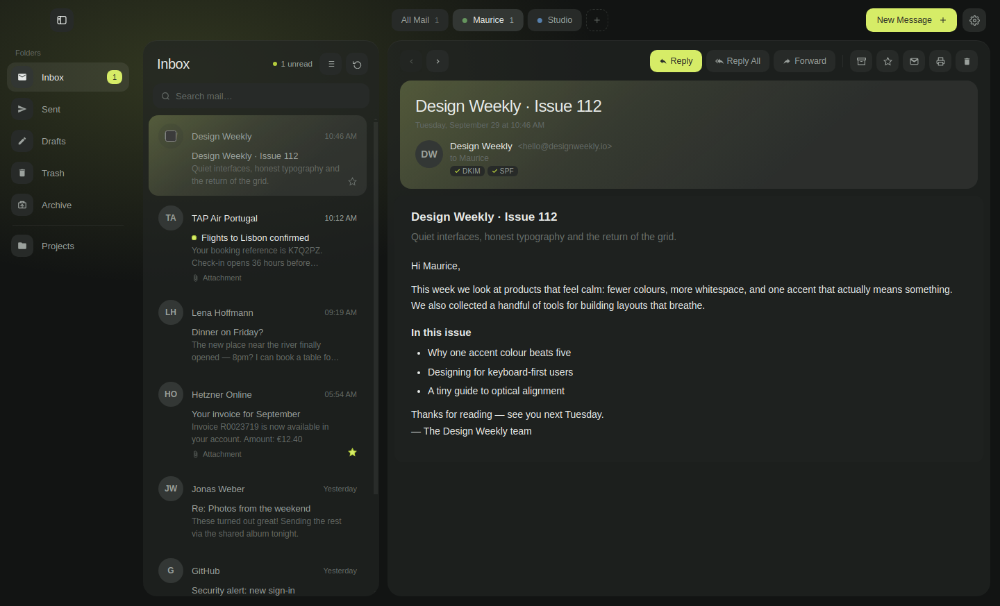
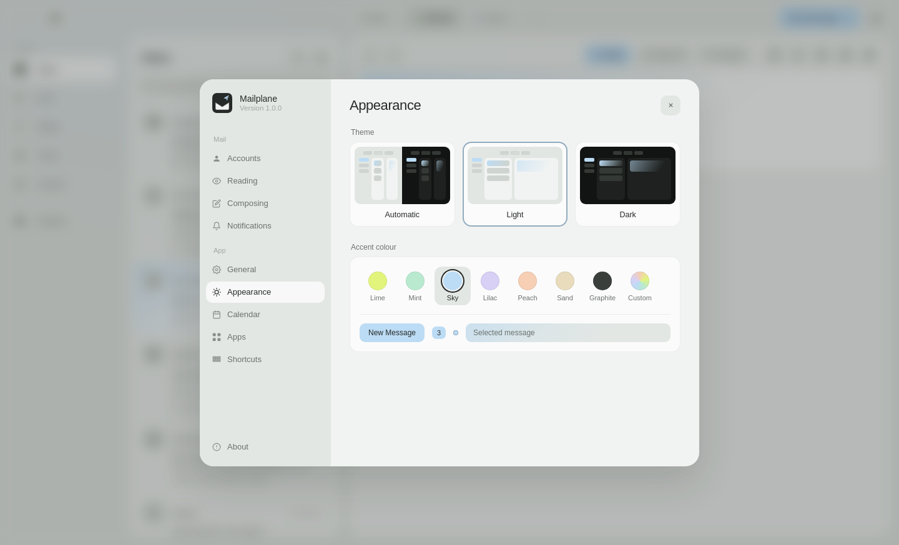
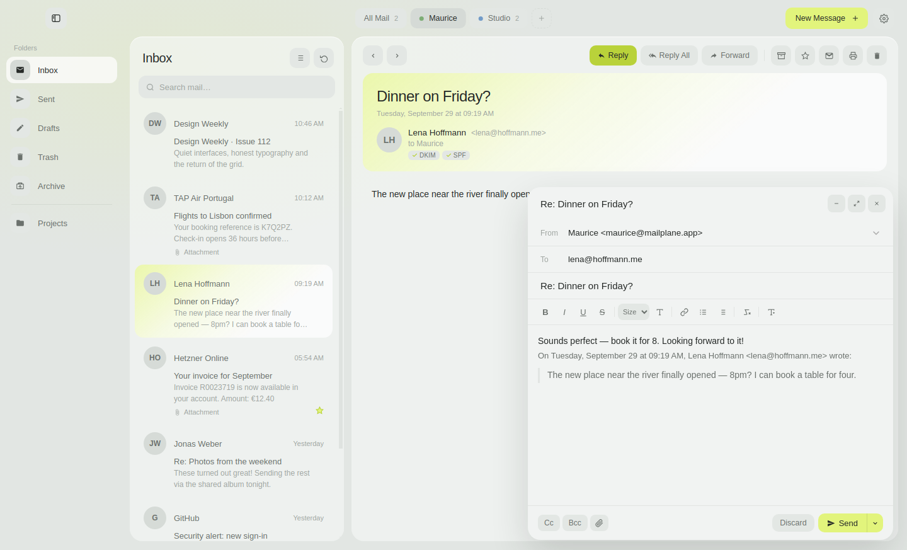
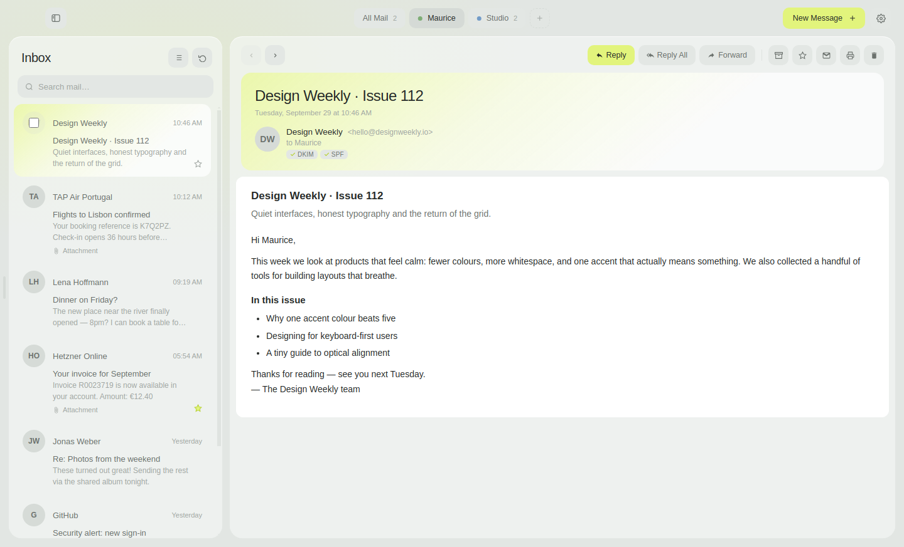

<div align="center">
  
  <h1>Mailplane</h1>
  <p><strong>Calm, fast email for every account you have.</strong><br/>
  macOS · Windows · Linux · Android</p>

  <p>
    <a href="https://github.com/mauricekleindienst/mailplane/releases/latest"></a>
    
    
    
    
  </p>
</div>

<p align="center">
  
</p>

Mailplane is an open-source email client that stays out of your way: quiet grey-green surfaces,
one accent colour, no tracking pixels, and keyboard shortcuts for everything. It works with Gmail,
Outlook, iCloud, Yahoo, Fastmail and any IMAP/SMTP server — on the desktop and on Android.

## Download

| Platform | Get it |
|---|---|
| **macOS** (Apple Silicon / Intel) | `Mailplane-<version>-mac-arm64.dmg` / `-mac-x64.dmg` |
| **Windows** 10+ | `Mailplane-<version>-windows-setup.exe` |
| **Linux** | `Mailplane-<version>-linux-x64.AppImage` or `-linux-amd64.deb` |
| **Android** 8.0+ | `Mailplane-<version>-android.apk` |

All files are on the **[latest release](https://github.com/mauricekleindienst/mailplane/releases/latest)** page.
The desktop apps update themselves.

> The builds are not code-signed yet. On macOS, right-click the app → **Open** the first time;
> on Windows, choose **More info → Run anyway**; on Android, allow installing from your browser.

---

## Highlights

### Set up in a minute
Type your address and Mailplane finds the servers — built-in settings for the big providers,
Mozilla's provider directory and your domain's autoconfig for everything else. If your provider
needs an *app password* (Gmail, iCloud, Yahoo, …) you get the exact steps and a direct link.
Incoming and outgoing mail are checked separately, so when something fails you know which one and why.

<p align="center">
  
  
</p>

### All your accounts, one calm inbox
Switch accounts from the pills in the title bar, or open **All Mail** to see every inbox at once —
each message tagged with a small dot in its account's colour.



### Light, dark, and your colour
Automatic, light or dark theme, and seven accent colours (or any colour you like).
Everything tinted — buttons, badges, the selection glow — follows your choice.

<p align="center">
  
  
</p>

### Write without friction
Rich text or plain text, inline images, attachments, per-account signatures, **Undo Send**,
**Send Later**, replies that thread correctly and never stack "Re: Re: AW:".



### Your layout
Drag the edges to resize the folder rail and message list, drag them away to hide them,
or press `⌘\` / `⇧⌘\` — like Obsidian. Mailplane remembers it.



## Features

**Mail**
- IMAP/SMTP with any provider; Fastmail via JMAP on the desktop
- Server-side search, thread grouping, stars, read/unread, archive, move by drag and drop
- Delete moves to Trash (and only deletes for good from Trash)
- Multi-select with bulk actions, right-click menu, trackpad swipes
- Push notifications for new mail (IMAP IDLE on desktop, background sync on Android)
- `mailto:` links open Mailplane

**Privacy & security**
- Passwords live in the system keychain (macOS Keychain, Windows DPAPI, libsecret) and the Android Keystore
- Remote images blocked until you ask; HTML mail rendered in a sandbox where scripts never run
- Links always open in your browser; no analytics, no telemetry

**Offline**
- Local SQLite cache — mail you've seen stays readable without a connection

**Extras (desktop)**
- CalDAV calendars with a month view
- Pin any web app next to your inbox
- Unread badge on the dock icon, auto-update

## Android

A native Kotlin / Jetpack Compose app with the same look: guided account setup, account pills,
folder drawer, swipe right to archive and left to delete, pull to refresh, a sandboxed reader,
reply / reply all / forward, accent colours and dark mode, and quiet new-mail notifications.
Passwords are encrypted with a key that never leaves the phone's Keystore.

The mail engine (`android/core`) is plain Kotlin and tested against a real in-memory IMAP/SMTP server.

## Keyboard shortcuts

| Keys | Action |
|---|---|
| `⌘N` | New message |
| `⌘R` / `⇧⌘R` | Reply / Reply all |
| `⌘F` | Forward |
| `↑` `↓` or `k` `j` | Previous / next message |
| `E` | Archive |
| `⌫` | Delete |
| `U` | Mark read / unread |
| `S` | Star / unstar |
| `/` | Search |
| `⌘\` / `⇧⌘\` | Show / hide sidebar / message list |
| `⇧⌘N` | Refresh |
| `⌘,` | Settings |
| `Esc` | Close / go back |

On Windows and Linux use `Ctrl` instead of `⌘`. Single-key shortcuts never fire while you're typing.

## Provider notes

| Provider | What you need |
|---|---|
| Gmail | An [app password](https://myaccount.google.com/apppasswords) (requires 2-Step Verification) |
| iCloud | An app-specific password from your [Apple Account](https://account.apple.com/account/manage) |
| Yahoo / AOL | An app password from the account security page |
| Outlook / Hotmail | Your password, or an app password with two-step verification. Work accounts that only allow browser sign-in (OAuth) aren't supported yet |
| Fastmail | An [API token](https://app.fastmail.com/settings/security/tokens) (desktop connects via JMAP) |
| GMX / WEB.DE | Turn on *POP3/IMAP access* in the web mail settings first |
| Anything else | Just your address and password — Mailplane looks up the servers, or you can enter them yourself |

Mailplane walks you through all of this during setup.

## Development

```bash
npm install          # also rebuilds better-sqlite3 for Electron
npm start            # run the desktop app (⌥⌘I for DevTools)

npm run lint
npm test             # unit tests
npm run test:e2e     # end-to-end + UI tests (Playwright driving the real app)
```

The E2E suite runs the real Electron app against an in-memory fake mailbox, so no mail account is needed.

**Android** (Android Studio or the SDK command-line tools):

```bash
cd android
./gradlew :core:test         # mail engine tests — no Android SDK required
./gradlew :app:assembleDebug # APK in app/build/outputs/apk/debug/
```

**Icons**: `assets/icon.svg` is the source; `npm run build:icons` renders `icon.png` and `icon.icns`.

## Releasing

```bash
npm run release:patch   # or release:minor / release:major
```

This bumps the version, tags `vX.Y.Z` and pushes. GitHub Actions then builds macOS, Windows,
Linux and Android in parallel, uploads everything to a draft release and publishes it once all
platforms succeeded. You can also start it from **Actions → Release → Run workflow**.

Optional signing via repository secrets — macOS: `CSC_LINK`, `CSC_KEY_PASSWORD`, `APPLE_ID`,
`APPLE_APP_SPECIFIC_PASSWORD`, `APPLE_TEAM_ID` · Windows: `WIN_CSC_LINK`, `WIN_CSC_KEY_PASSWORD` ·
Android: `ANDROID_KEYSTORE_BASE64`, `ANDROID_KEYSTORE_PASSWORD`, `ANDROID_KEY_ALIAS`, `ANDROID_KEY_PASSWORD`.

## Architecture

| | Desktop | Android |
|---|---|---|
| UI | Electron 30, vanilla JS + CSS | Kotlin, Jetpack Compose, Material 3 |
| Mail | imapflow, nodemailer, mailparser, JMAP client | javax.mail (android-mail) in `android/core` |
| Storage | electron-store, SQLite cache (better-sqlite3) | SharedPreferences + Android Keystore |
| Secrets | Electron `safeStorage` | AES-GCM key in the Android Keystore |
| Updates | electron-updater (GitHub Releases) | new APK per release |

The desktop renderer has no Node access — a `contextBridge` preload exposes an explicit allowlist of IPC channels.
